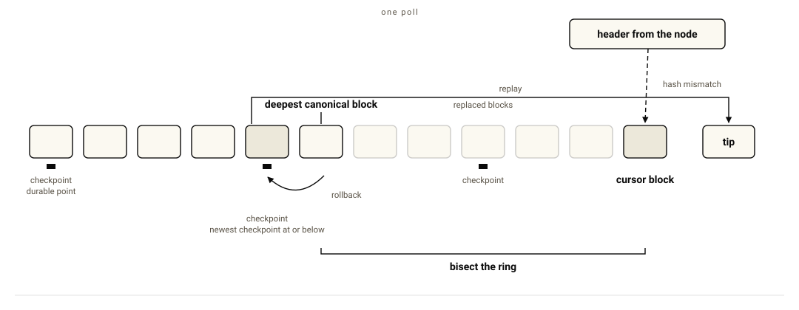
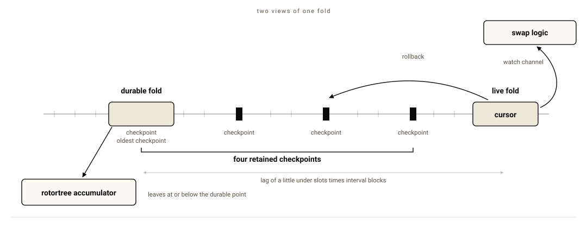
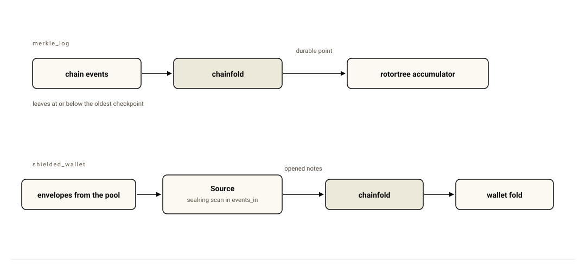

*Part of "Building blocks", the series on the primitives for confidential systems on Ethereum. The blocks live in [ethsystems/works](https://github.com/ethsystems/works).*

While authoring our earlier building blocks, we noticed that they both relied on a singular component: on-chain state. Consuming on-chain state for realtime applications can be cumbersome once you take reorgs, restarts and RPC downtime into consideration. This leaves the resulting code taking three directions,

a. Design your off-chain state in such a way that it can be rolled back and reconciled with the canonical tip of the chain,

b. Replace the real-time ingestion of events with a poll-based loop that waits for blocks to be finalized to process their events, or

c. Take a dependency on an external service to give you a canonical event stream.

Unfortunately, a large number of libraries in the space, either tie you into the runtime, the io, or even a storage backend that is required for persisting these events. So what do you do when your stack doesn't match any of them? You build your own reorg-aware event stream.

To explain the usage of this library better, we'll look at it through the lens of [one of our earlier PoCs](/writeups/private-crosschain-atomic-swaps-part-2-of-2/). In the PoC, a central multi-chain "settlement coordinator" keeps some state locally that determines if a cross-chain swap can be executed. Therefore, it needs an ordered view of events from each chain before it can update its local state, because if not, the service has a liveness failure. 

The PoC's requirements for consuming on-chain state, then become the following:

> give me the events in canonical order, keep my state consistent when the chain reorganizes, and let me decide when that state is durable enough for the next part of the system.

It does not particularly care whether the on-chain polling loop runs on [Tokio](https://tokio.rs), the async runtime a _majority_ of the Rust community uses, or on a plain thread. It may already have an RPC client and a storage system. It may want the latest block, or it may prefer to follow a more conservative confirmation point.

`chainfold` was created as a solution to this problem, to be plugged into almost _any_ stack that requires durable reorg-aware event streams.

## What you choose

A majority of applications that depend on on-chain state, differ in the following ways, and `chainfold` is designed to cover them all:

First is **where the chain reads come from**. The application supplies the chain source. That means it can plug into the provider or RPC stack already used by the service rather than introducing another one.

Second is **which head to follow**. The application can decide whether to follow the latest block, or, use Ethereum's `safe` block.

Third is **how much reorg history to retain**. Checkpoints give the fold places to which it can safely roll back. Their spacing and number determine how much history can be recovered locally and how much state has to be replayed.

Fourth is **where durable state lives**. Checkpoints are persisted to a storage backend of the application's choice.

And finally, **where the polling loop runs** is up to the application. The driver does not require an async runtime.

## `chainfold`'s architecture


*Figure 1: Data flow diagram*

## How often does a fork occur?

On Ethereum mainnet, there have been 1842 reorgs in 2026[^1], with an average reorg depth of 1. Privately run consortium chains behave differently depending on the consensus mechanism used.

Going back to the example we mentioned earlier, the settlement coordinator follows one chain at a time. Its local fold might have already processed a block when that block stops being canonical.

An important invariant of the system is that the downstream state should not silently continue from a fork.

`chainfold` checks the cursor's block header on every poll. If the blockhash has changed, it knows that the history behind the cursor has changed too. This also works when the chain has not advanced: the process does not need to wait for another block before noticing the replacement.

Recovery then uses the history already retained by `chainfold`'s driver to find the deepest block that is still canonical. The fold is rolled back to a checkpoint at or before that block and replayed from there.

The design here is similar to a write-ahead log.

If the fork reaches beyond the retained checkpoints, _local_ recovery is no longer possible and `chainfold`'s engine escalates to a resynchronization.



*Figure 2: detecting a reorg and recovering the local fold.*

The checkpoint configuration is tunable because each application has unique requirements, and some might want to be more strict, while others might want to relax the constraint. The table below describes how the memory characteristic of the library changes with different combinations of checkpoint-related parameters.

Each ring entry holds an 8-byte block number and a 32-byte hash.

| `ring_capacity` | `checkpoint_slots` | `checkpoint_interval` |    ring size | fold clones | deepest reorg handled |
| --------------: | -----------------: | --------------------: | ------: | ---------------: | --------------------: |
|            1024 |                  0 |                   n/a |  40 KiB |                0 |                resync |
|            1024 |                  4 |                    64 |  40 KiB |                4 |             up to 256 |
|            1024 |                  8 |                    64 |  40 KiB |                8 |             up to 512 |
|            4096 |                  4 |                   256 | 160 KiB |                4 |            up to 1024 |

Finding a balance of these parameters is useful when sizing the recovery window: checkpoint spacing determines how much replay a recovery can require, while the retained checkpoints determine how far back the fold can roll without starting again.

## Latest or safe?

The reorg window is only one side of the problem. The other is which block the application considers its head.

Following the latest block gives the application the newest state. It also means that state can subsequently need to be rolled back.

Following the `safe` block moves the fold behind the tip. That adds latency, but reduces the amount of reorg handling the application is exposed to.

This is becoming a more interesting choice on Ethereum. The [Fast Confirmation Rule](https://fastconfirm.it/) was [merged](https://github.com/ethereum/consensus-specs/pull/4747) into the consensus specifications in April of this year as a client-side change rather than a hard fork. Once supported by clients, the `safe` tag can represent the fast-confirmed execution block. The rule is still based on a synchrony assumption: the specification explicitly notes that violating it can allow a confirmed block to be reorged without adversarial behaviour or slashing. [The paper](https://arxiv.org/abs/2405.00549) describes the confirmation rule and its assumptions.

The point for `chainfold` is simpler. The library does not decide which confirmation policy the application should use.

That lets the same ordering machinery serve an application that wants the lowest possible latency and another that would rather accept some delay before exposing state downstream.

Let's work through this with another example. [`rotortree`](/writeups/building-blocks-rotortree) is designed to be an append-only data structure. Given how it is designed, it is difficult to roll back state that might have already been persisted to disk. `rotortree` also performs very well with batched updates. Hence, it is more idiomatic to buffer the dependent on-chain events until they are confirmed, before mutating it.

Our `merkle_log` example shows this design: `rotortree` consumes the durable view.



*Figure 3: the live and durable views exposed by the fold.*

## In the event of an outage

Without persisted state, the settlement coordinator has to reconstruct its fold from the deployment block when it comes back up.

With a snapshot sink, checkpoints can be persisted independently of the application state itself. The storage system is not prescribed: a filesystem adapter can be used directly, while an application that already has a database or object store can provide its own sink.

`chainfold`'s snapshots include the observed chain history as well as the folded state. After a restart, the driver therefore has enough information to notice that a reorg happened while the process was down rather than assuming that the previously persisted cursor is still canonical.

The durable cursor only advances with the persisted checkpoint. A downstream system can therefore distinguish between state the process has merely computed and state it has actually made durable.

The snapshot state is deterministic as well. An engine restored from a snapshot and an engine that continued running through the same blocks produce byte-identical state after processing the same sequence.

## Bring your own runtime

`chainfold` does not require Tokio, smol, or another async runtime. Its driver exposes the cadence and recovery loop without owning the runtime around it. This decision was made to allow for easy integration into legacy codebases, which might be written in languages that do not have wide support for Ethereum. 

If the consumer already has a runtime, it can keep using it. If it does not need one, the driver can run on a plain worker thread instead.

The settlement coordinator runs `chainfold`'s driver on a standard thread while its chain source uses the existing Tokio-based RPC path. A Tokio harness is available when the application wants one, feature flagged.

## The cost of recovering

The normal fold path is designed to have zero overhead (no allocations in the hot path, actual fold duration determined by consumer logic). The measurements below describe how the system behaves when a reorg is detected, and recovery must be executed.

In the context of the settlement coordinator, we use the following parameters:

| parameter                       |      value |
| ------------------------------- | ---------: |
| `ring_capacity`                 |       1024 |
| `checkpoint_slots`              |          4 |
| `checkpoint_interval`           |  64 blocks |

| case                             | events replayed |     time |
| -------------------------------- | --------------: |  ------: |
| recover, depth 1                 |             132 |      18.0 µs |
| recover, depth 7                 |             132 |      18.2 µs |
| recover, depth 64                |             388 |      19.8 µs |
| recover, depth 200               |             900 |      23.7 µs |
| rollback tick, 1.4k fold entries |               0 |      13.9 µs |
| rollback tick, 88k fold entries  |               0 |      63.8 µs |

These are engine-only figures, and do not measure the overhead from RPC calls.

*Run on an M4 Pro with 14 cores and 48 GB of memory. Benchmark at a pinned revision: [`124a368`](https://github.com/ethsystems/works/commit/124a368e2af266f3da5e1b520acea5fb646fcbbc).*

## Composition with the other building blocks

There are two[^1] [runnable examples](https://github.com/ethsystems/works/tree/main/crates/examples) in the repository.

`merkle_log` integrates `chainfold` with `rotortree`. Chainfold maintains the ordered fold and rotortree consumes its durable view.

`shielded_wallet` composes it with `sealring`. Chainfold supplies ordered events while sealring determines which notes belong to the wallet owner.



*Figure 4: chainfold composed with rotortree and sealring.*

## Why `no_std`?

The core of `chainfold` is `no_std` + `alloc`. With a compatible fold, that makes the deterministic ordering and application logic usable inside zkVM guests such as [Jolt](https://github.com/a16z/jolt), [SP1](https://github.com/succinctlabs/sp1), or [Risc0](https://github.com/risc0/risc0).

That opens up a different use-case altogether: proving that a particular ordered set of chain events was applied to a particular state according to the fold's transition logic. This is relevant when proving to an auditor that your software executed on its data dependencies correctly.

## Prior art

The closest existing design we looked at is Alloy's [reorg-aware provider streams](https://docs.rs/alloy-provider/latest/alloy_provider/struct.WatchCanonicalBlocksFrom.html).

Alloy's stream detects a replacement when a new block arrives whose parent does not match the buffered tip. Its recovery walks backwards through the replacement history and emits removed events before emitting the new canonical segment. The consumer is responsible for undoing the removed events, either by making its state invertible or by maintaining its own checkpoints.

The stream retains a bounded in-memory history, 64 blocks by default. A deeper reorg ends the stream because the canonical history needed to recover is no longer retained. Nothing about that stream persists the history across a restart.

Some indexer frameworks have different aspects that lock you into a specific stack. 

[graph-node](https://thegraph.com/docs/en/indexing/tooling/graph-node/), [Ponder](https://ponder.sh), [Squid SDK](https://docs.sqd.dev/en/sdk/squid-sdk/evm/design) and [Envio](https://docs.envio.dev/docs/HyperIndex/overview) all depend on Postgres in some capacity. These solutions solve for different problems, they optimize for queryability.

`chainfold` makes the different boundaries explicit. The consumer supplies the chain reads, chooses the runtime, chooses its confirmation point, configures its recovery window, and can persist checkpoints through its own storage backend. Recovery rolls the fold back to retained state and replays the canonical segment rather than requiring the consumer to implement inverse operations.

## When to not use `chainfold`

It was an explicit design decision to expose all the configuration parameters to the consumer of the library. This could result in additional complexity that is not required for your application.

`chainfold` is unsuitable for a chain that cannot have reorgs, however, the checkpoint and recovery features still help there.

`chainfold` is early. The API is subject to change.

For developers of legacy systems, or those who would like to tune the parameters of durable reorg-aware event streaming, give `chainfold` a spin:

```bash
cargo add chainfold
```

`chainfold` is [on crates.io](https://crates.io/crates/chainfold) and lives in [ethsystems/works](https://github.com/ethsystems/works), under MIT or Apache-2.0. The API docs are on [docs.rs](https://docs.rs/chainfold).

[^1]: At the time of writing
